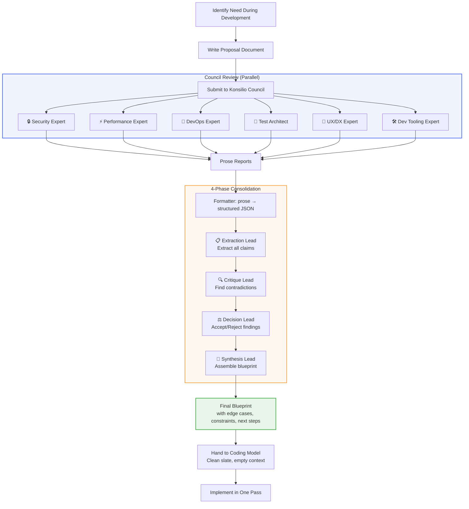

# Konsilio

Konsilio lets you run a draft plan through a panel of AI experts (security, performance, DevOps, etc.) before writing code.

It returns a structured blueprint so your coding model can implement it cleanly in one pass.

## The Problem

You're mid-task and realize you need a plan: *"Why is this code not working? We need more logs → logging should be added → let me write a proposal for logging."*

You could feed that plan directly into a coding model and hope it gets it right. Or you could catch blind spots early by having specialists review it first.

## The Solution

Konsilio implements a **multi-stage consulting pipeline**:

1. **Write a proposal** — a short document describing what you want to build or change
2. **Feed it to the Council** — multiple expert personas (security, performance, DevOps, testing, etc.) review the plan in parallel, each from their own angle
3. **4-phase consolidation** — a lead agent extracts claims, critiques contradictions, makes accept/reject decisions, and synthesizes a final blueprint
4. **Implement with a clean slate** — hand the blueprint to a coding-focused model. It starts with empty context and executes the plan in one pass

**Rinse. Repeat. Rewind Selectah!**

## Usage

```bash
# Install
npm install -g konsilio

# Configure (edit konsilio.json with your personas and models)
# Set OPENROUTER_API_KEY in your environment

# Use via MCP in your AI coding tool
# Tool: consult_council
# Params: draft_plan, tech_stack (optional), context_constraints (optional)
```

### Example

```json
{
  "draft_plan": "Add structured logging to all API endpoints with correlation IDs",
  "tech_stack": "Node.js, Express, Pino, PostgreSQL",
  "context_constraints": "Must run on Proxmox LXC, no external dependencies"
}
```

Returns a blueprint with architecture directives, edge cases, constraints, and numbered next steps.

## Configuration

```json
{
  "personas": {
    "enabled": ["security", "performance", "devops", "test-architect"]
  },
  "models": {
    "experts": "google/gemini-2.5-flash-lite",
    "lead": "google/gemini-2.5-pro"
  }
}
```

Default personas: `security`, `performance`, `ux-dx`, `devops`, `typescript`, `graph-dba`, `node-fullstack`, `dev-tooling`, `distributed-systems`, `test-architect`



## Architecture

### Expert Personas

Each expert is a focused agent with a specific lens:

| Persona | Focus | Config Name |
|---------|-------|-------------|
| 🔒 Security Architect | Auth, injection, rate limiting, data exposure, secrets lifecycle | `security` |
| ⚡ Performance Engineer | Bottlenecks, caching, query patterns, scaling, cost efficiency | `performance` |
| 🔧 DevOps Engineer | Deployment, observability, infrastructure, IaC, auto-scaling | `devops` |
| 🧪 QA/Test Architect | Coverage, edge cases, testability, chaos engineering, contract testing | `test-architect` |
| 🎨 UX/DX Designer | API design, developer experience, ergonomics, accessibility | `ux-dx` |
| 🛠️ Developer Tooling Specialist | Build pipeline, CI/CD, code generation, test frameworks, monorepo | `dev-tooling` |
| 📘 TypeScript Engineer | Static types, module boundaries, async flow, generics, compiler config | `typescript` |
| 🚀 Node/TypeScript Fullstack Engineer | REST/GraphQL APIs, auth, middleware, WebSocket/SSE, error boundaries | `node-fullstack` |
| 🕸️ Graph Data Modeler | Vertex-edge design, traversal performance, query patterns, schema evolution | `graph-dba` |
| 🌐 Distributed Systems Engineer | Consensus, fault tolerance, messaging, event-driven, saga orchestration | `distributed-systems` |

Experts output **prose** — free-form analysis without JSON constraints.

**Note:** User-defined experts can be created by adding an `<expert-name>.md` file to `/data/personas/`

### The Lead

The lead agent runs a 4-phase consolidation pipeline:

1. **Extraction** — pulls all claims from expert reports into a unified list
2. **Critique** — identifies contradictions, unsupported claims, and gaps
3. **Decision** — explicitly accepts or rejects each finding
4. **Synthesis** — assembles accepted findings into a coherent blueprint

### The Formatter

A dedicated `gpt-4o-mini` instance converts expert prose to structured JSON using OpenAI's `response_format` feature. This keeps experts focused on analysis, not syntax.

## Why This Works

### 1. Specialized Experts Outperform Generalists

A council of focused expert agents, each primed with a specific role, surfaces more issues at lower cost than a single frontier model:

- **Chan et al. (2023)** — *"ChatEval: Towards Better LLM-based Evaluators through Multi-Agent Debate"* — showed that multiple role-conditioned agents debating produces more accurate evaluations than a single powerful model. [arXiv:2308.07201](https://arxiv.org/abs/2308.07201)

- **Du et al. (2023)** — *"Improving Factuality and Reasoning in Language Models through Multiagent Debate"* — demonstrated that multi-agent debate significantly improves accuracy over single-model inference, with agents catching each other's errors. [arXiv:2305.14325](https://arxiv.org/abs/2305.14325)

- **Liang et al. (2023)** — *"Ensemble Learning for Large Language Models"* — found that combining multiple specialized models outperforms a single large model on complex tasks while using fewer total tokens. [arXiv:2305.07881](https://arxiv.org/abs/2305.07881)

### 2. Separation of Analysis and Formatting

When a model is asked to return structured data directly, its reasoning quality degrades. Konsilio solves this by having experts write **prose first**, then using a dedicated formatter:

- **Dhuliawala et al. (2023)** — *"Chain-of-Verification Reduces Hallucination in Large Language Models"* — demonstrates that separating generation from verification significantly reduces errors. This is the core principle behind Konsilio's two-stage design. [arXiv:2309.11495](https://arxiv.org/abs/2309.11495)

- **Willison et al. (2023)** — *"Jsonformer: A Bulletproof Way to Generate Structured JSON from Language Models"* — documents how JSON schema constraints during generation interfere with reasoning quality, recommending a two-stage approach: generate content freely, then format. [arXiv:2305.15087](https://arxiv.org/abs/2305.15087)

- **Su et al. (2024)** — *"The Impact of Reasoning Step Length on Large Language Models"* — shows that adding structural constraints (like JSON output requirements) during reasoning reduces the model's ability to explore solution spaces, increasing error rates. [arXiv:2401.04991](https://arxiv.org/abs/2401.04991)

This is why Konsilio uses `gpt-4o-mini` as a **dedicated formatter** — it converts prose to JSON without the expert models having to juggle both reasoning and formatting simultaneously.

### 3. Clean-Slate Implementation

By separating planning from execution, the coding model starts with **zero context overhead**. It receives a complete blueprint and executes — no need to re-derive the plan or carry forward the reasoning history. This reduces token costs and avoids context-window pollution.

# License

This software is released under the Unlicense: do whatever you want with it.
